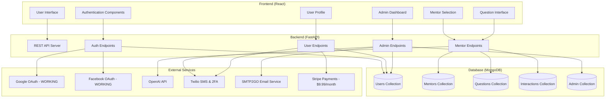
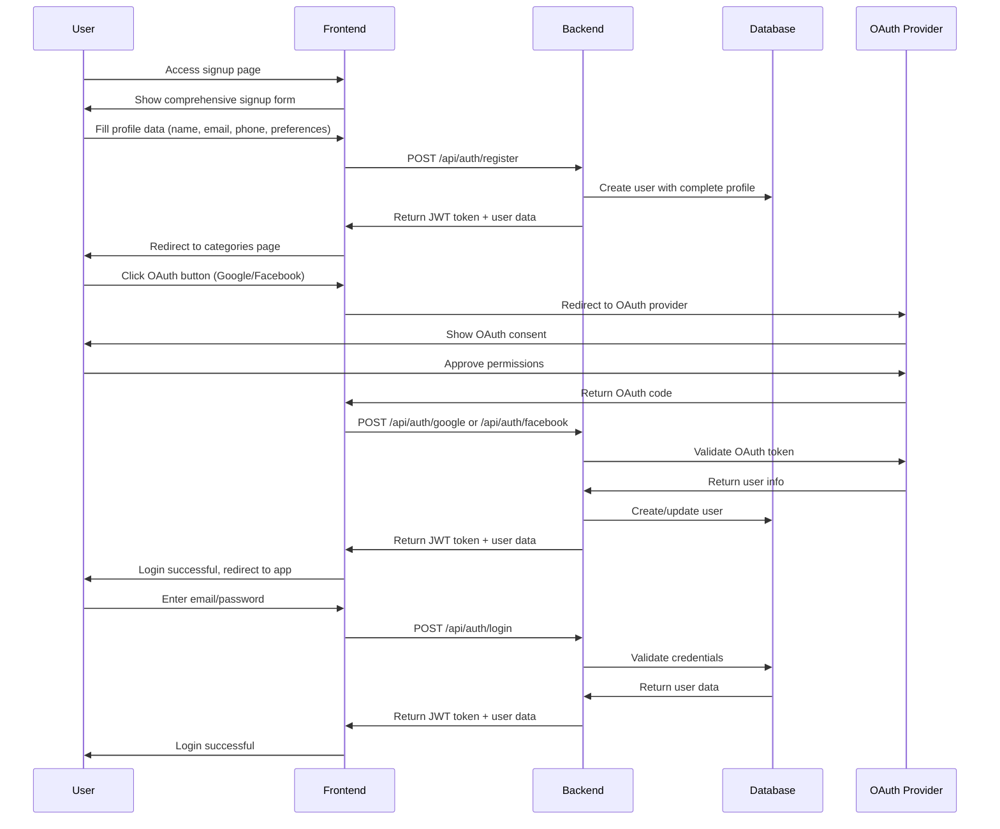
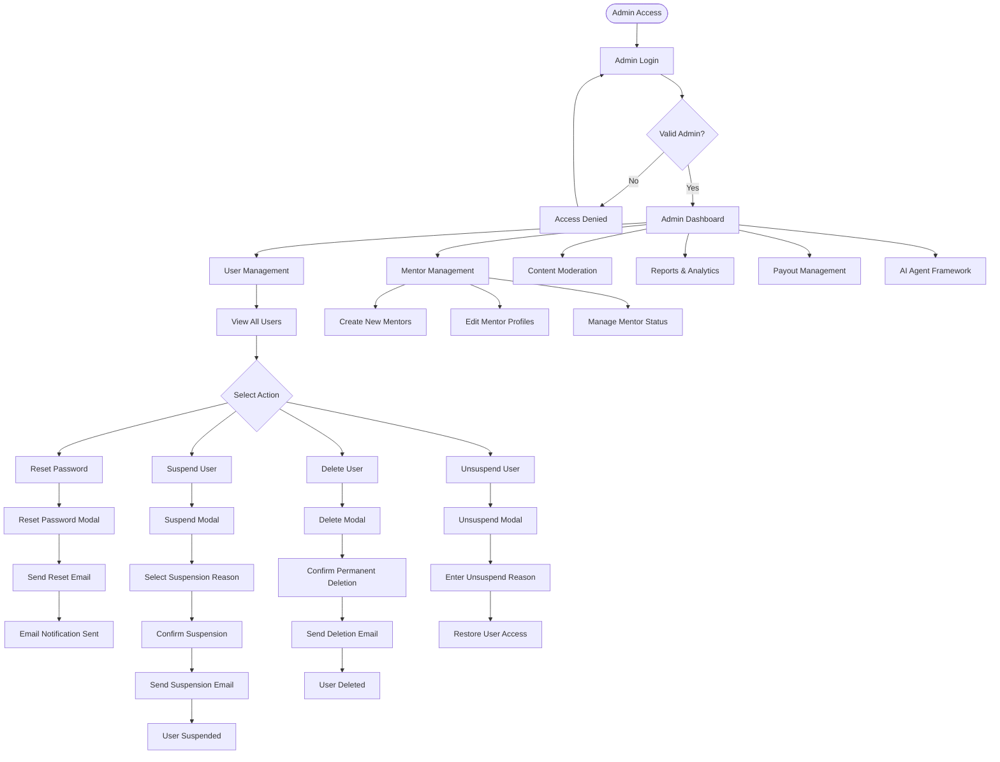
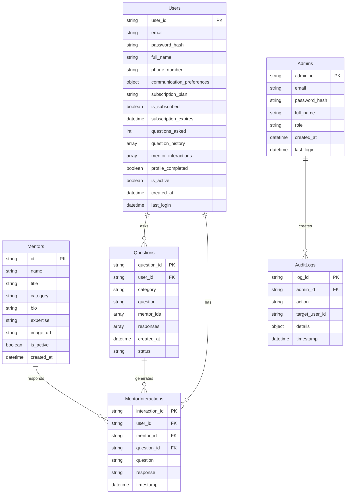
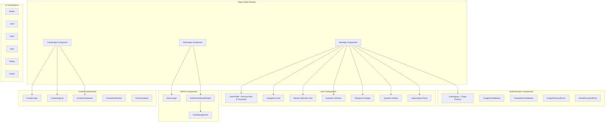

# OnlyMentors.ai - Updated Workflow Diagrams (Complete Platform)

## 1. Overall System Architecture



## 2. User Authentication Flow



## 3. User Journey Flow

```mermaid
flowchart TD
    Start([User Visits Site]) --> Auth{Authenticated?}
    
    Auth -->|No| Login[Login/Signup Page]
    Auth -->|Yes| Categories[Categories Page]
    
    Login --> OAuth[OAuth Buttons]
    Login --> EmailAuth[Email/Password Form]
    Login --> CompSignup[Comprehensive Signup]
    
    OAuth --> GoogleAuth[Google OAuth]
    OAuth --> FacebookAuth[Facebook OAuth]
    
    EmailAuth --> ValidateAuth{Valid Credentials?}
    ValidateAuth -->|No| AuthError[Show Error]
    ValidateAuth -->|Yes| Categories
    
    CompSignup --> Step1[Step 1: Personal Info]
    Step1 --> Step2[Step 2: Subscription Plan]
    Step2 --> Step3[Step 3: Payment/Review]
    Step3 --> CreateAccount[Create Account]
    CreateAccount --> Categories
    
    Categories --> SelectCategory[Select Category]
    SelectCategory --> MentorGrid[Mentor Grid]
    MentorGrid --> SelectMentors[Select Mentors (Max 5)]
    SelectMentors --> QuestionForm[Question Form]
    QuestionForm --> SubmitQuestion[Submit Question]
    
    SubmitQuestion --> CheckSubscription{Subscribed?}
    CheckSubscription -->|No| CheckLimit{Questions Left?}
    CheckLimit -->|No| Subscription[Subscription Page]
    CheckLimit -->|Yes| ProcessQuestion[Process Question]
    CheckSubscription -->|Yes| ProcessQuestion
    
    ProcessQuestion --> AIResponse[Get AI Responses]
    AIResponse --> ShowResponses[Show Responses]
    ShowResponses --> NextAction{User Choice}
    
    NextAction --> AskAgain[Ask Another Question]
    NextAction --> DiffMentors[Select Different Mentors]
    NextAction --> History[View History]
    NextAction --> Profile[User Profile]
    
    Categories --> Profile
    Profile --> EditProfile[Edit Profile Information]
    Profile --> ChangePassword[Change Password]
    Profile --> CommPrefs[Communication Preferences]
    
    AuthError --> Login
    AskAgain --> QuestionForm
    DiffMentors --> MentorGrid
    Subscription --> Payment[Stripe Checkout]
    Payment --> Categories
```

## 4. Admin Workflow



## 5. Data Flow & Relationships



## 6. Component Architecture



## 7. API Endpoint Map

```mermaid
mindmap
  root((OnlyMentors.ai API))
    Authentication
      POST /api/auth/register
      POST /api/auth/login
      POST /api/auth/google
      POST /api/auth/facebook
      GET /api/auth/me
      POST /api/forgot-password/request
      POST /api/forgot-password/reset
    
    User Management
      GET /api/user/profile
      PUT /api/user/profile
      GET /api/user/profile/complete
      PUT /api/user/profile/communication-preferences
      GET /api/user/question-history
      PUT /api/user/password
    
    Mentors & Questions
      GET /api/categories
      POST /api/questions/ask
      GET /api/questions/history
      POST /api/mentor/{mentor_id}/ask
    
    Admin Endpoints
      POST /api/admin/login
      GET /api/admin/users
      PUT /api/admin/users/{user_id}/suspend
      PUT /api/admin/users/{user_id}/reset-password
      DELETE /api/admin/users/{user_id}
      GET /api/admin/audit-logs
    
    Payments
      POST /api/payments/checkout
      GET /api/payments/status/{session_id}
```